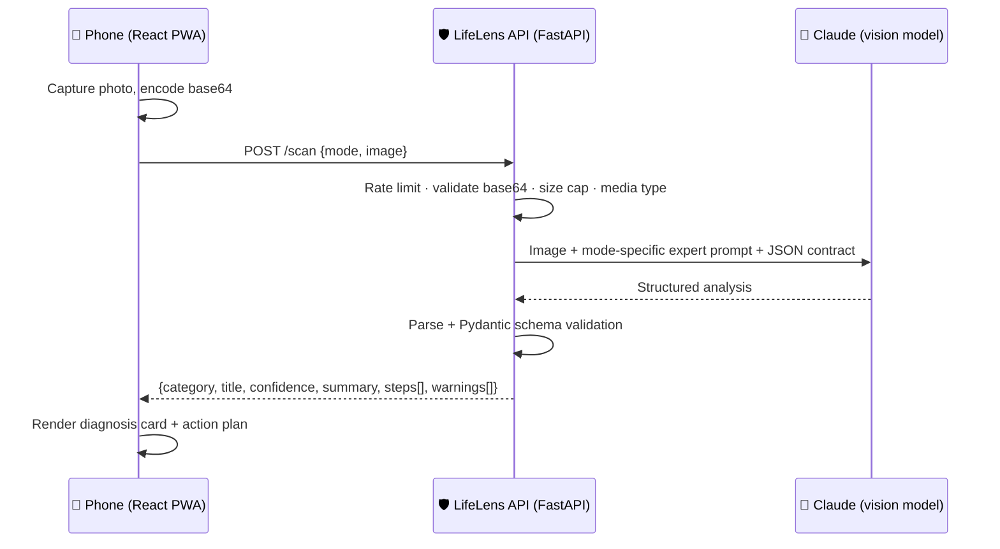

# LifeLens 🤖

**Meet Berry: a pocket helper for any life task. Cook from what's in your fridge, scan what you can't figure out, ask anything.**

**Live at:** https://lifelens-two.vercel.app

Try it now on any device: camera on iPhone/Android, drag-and-drop or paste (Cmd/Ctrl+V) on Mac/Windows. Installable as an app on all four platforms.

Tell Berry the five ingredients in your kitchen and get a menu of real dishes from world cuisines, then a full recipe scaled to who's eating. Photograph a utility bill, a dishwasher flashing `E24`, a nutrition label, a form in another language. Or just ask: passport renewals, rent disputes, weird car noises. One app, three tabs (Cook, Scan, Ask), every answer structured into steps you can act on, powered by multimodal LLMs behind a hardened API.

   

## Why this project

Most AI demos are chat windows. Real life isn't text; it's the physical stuff in front of you. LifeLens demonstrates how to ship multimodal AI as a product, not a prompt:

- **A conversational assistant with a face:** Berry, an SVG robot mascot with day/night variants and moods, fronts two chat experiences: Cook (ingredients in, feasible multicultural dish menus and scaled recipes out) and Ask (life questions in, direct answers with numbered steps, a concrete goal, and cited sources out), with on-device saved conversations
- **Vision + LLM reasoning** over real photos, with five expert scan "modes" (identify-anything, document explanation, appliance repair, nutrition, translation), plus an optional note/question attached to any scan, and photo input inside every chat
- **Agentic web search:** toggle the globe and the model researches uncertain or time-sensitive subjects on the live web, returning cited sources in the same structured schema
- **Schema-enforced structured output:** the model is contracted to a strict JSON shape, validated server-side with Pydantic before anything reaches a phone
- **Security-first API design:** the model key never ships to the client; the FastAPI proxy adds input validation, payload limits, per-IP rate limiting, and CORS controls
- **Truly cross-platform:** one PWA codebase that installs on iOS, Android, Mac, and Windows; camera capture on phones, drag-and-drop and clipboard paste (Ctrl/Cmd+V) for screenshots on laptops, with a two-column layout on wide screens
- **Tested and CI-gated:** pytest suite covering schema contracts, prompt construction, and endpoint guards, run on every push

## How it works



The key design decision: **exactly two output contracts, each with one rendering path.** Every scan mode shares the `ScanResult` schema (one result card renders a bill explanation and an appliance fix alike), and both chat tabs share the `ChatReply` schema (one message component renders dish menus, recipes, goals, and sources). `/chat` follows the same proxy pattern as the diagram above with conversation history replayed each turn, a chat-tuned model (Opus class) doing the reasoning, and the same tolerant-parse-then-validate pipeline before anything reaches a phone.

## Run it locally

**Backend** (Python 3.11+):

```bash
cd backend
pip install -r requirements-dev.txt
export ANTHROPIC_API_KEY=sk-ant-...   # get one at console.anthropic.com
uvicorn app.main:app --reload          # http://localhost:8000
```

**Frontend** (Node 18+):

```bash
cd frontend
npm install
npm run dev                            # http://localhost:5173 (proxies /scan + /chat to :8000)
```

Open it on your phone via your machine's LAN IP to use the real camera, then point it at the nearest confusing thing.

**Tests:**

```bash
cd backend && python -m pytest
```

## Project structure

```
lifelens/
├── frontend/          # React 18 + Vite PWA, mobile-first
│   └── src/
│       ├── App.jsx    # Shell: tabs, theming, greeting, settings state
│       ├── berry.jsx  # The mascot (day/night variants, moods)
│       ├── api.js     # Typed client for the backend
│       └── components/  # ChatView, ScanView, dish cards, settings, history
├── backend/
│   ├── app/
│   │   ├── main.py    # FastAPI: /scan + /chat endpoints, rate limiting, validation
│   │   ├── models.py  # Pydantic contracts: ScanResult + ChatReply
│   │   └── prompts.py # Berry persona, mode briefs, safety rules, contracts
│   └── tests/         # Schema, prompt, and endpoint guard tests
├── docs/ARCHITECTURE.md
└── .github/workflows/ci.yml
```

## Engineering decisions worth reading

See [docs/ARCHITECTURE.md](docs/ARCHITECTURE.md) for the full write-up, including why the prompt contract lives server-side, how malformed model output is handled as a `502` rather than a crash, the rate limiter trade-offs, client-side image downscaling, and the roadmap (streaming responses, on-device caching, multi-image scans, conversation follow-ups).

## Built in public

The entire build is journaled milestone-by-milestone in [docs/DEVLOG.md](docs/DEVLOG.md): what was built, why, and which real-world problem each change solved (including the bug where full-resolution phone photos silently exceeded the vision API's payload limit). The working discipline throughout: commit per achievement, devlog every milestone, push green.

## License

MIT. Use it, fork it, ship it.
