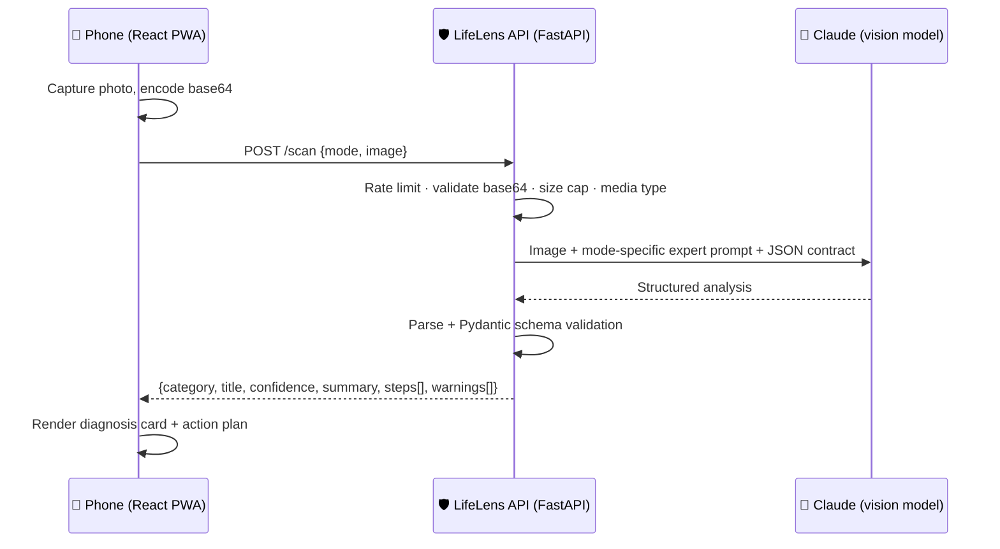

# LifeLens 📷

**Point your camera at any real-world problem. Get expert, structured help in seconds.**

A sick houseplant. A utility bill you don't understand. A dishwasher flashing `E24`. A nutrition label. A government form in another language. LifeLens is one mobile-first app that turns a photo of any of these into a plain-language diagnosis and a concrete action plan — powered by a multimodal LLM behind a hardened API.

   

## Why this project

Most AI demos are chat windows. Real life isn't text — it's the physical stuff in front of you. LifeLens demonstrates how to ship multimodal AI as a product, not a prompt:

- **Vision + LLM reasoning** over real photos, with six expert "modes" (identify-anything, plant pathology, document explanation, appliance repair, nutrition, translation), plus an optional note/question attached to any scan
- **Agentic web search** — toggle "Search online" and the model researches uncertain or time-sensitive subjects on the live web, returning cited sources in the same structured schema
- **Schema-enforced structured output** — the model is contracted to a strict JSON shape, validated server-side with Pydantic before anything reaches a phone
- **Security-first API design** — the model key never ships to the client; the FastAPI proxy adds input validation, payload limits, per-IP rate limiting, and CORS controls
- **Truly cross-platform** — one PWA codebase that installs on iOS, Android, Mac, and Windows; camera capture on phones, drag-and-drop and clipboard paste (Ctrl/Cmd+V) for screenshots on laptops, with a two-column layout on wide screens
- **Tested and CI-gated** — pytest suite covering schema contracts, prompt construction, and endpoint guards, run on every push

## How it works



The key design decision: **every mode shares one output contract.** Swapping the expert persona server-side while keeping the response schema fixed means the frontend renders a plant diagnosis and a bill explanation with the same component — adding a seventh mode is a five-line change in `backend/app/prompts.py`.

## Run it locally

**Backend** (Python 3.11+):

```bash
cd backend
pip install -r requirements-dev.txt
export ANTHROPIC_API_KEY=sk-ant-...   # get one at console.anthropic.com
uvicorn app.main:app --reload          # http://localhost:8000
```

**Frontend** (Node 18+):

```bash
cd frontend
npm install
npm run dev                            # http://localhost:5173 (proxies /scan to :8000)
```

Open it on your phone via your machine's LAN IP to use the real camera, then point it at the nearest confusing thing.

**Tests:**

```bash
cd backend && python -m pytest
```

## Project structure

```
lifelens/
├── frontend/          # React 18 + Vite PWA, mobile-first
│   └── src/
│       ├── App.jsx    # Viewfinder UI, modes, result rendering
│       └── api.js     # Typed client for the backend
├── backend/
│   ├── app/
│   │   ├── main.py    # FastAPI: /scan endpoint, rate limiting, validation
│   │   ├── models.py  # Pydantic request/response contracts
│   │   └── prompts.py # Per-mode expert prompts + shared output contract
│   └── tests/         # Schema, prompt, and endpoint guard tests
├── docs/ARCHITECTURE.md
└── .github/workflows/ci.yml
```

## Engineering decisions worth reading

See [docs/ARCHITECTURE.md](docs/ARCHITECTURE.md) for the full write-up, including why the prompt contract lives server-side, how malformed model output is handled as a `502` rather than a crash, the rate limiter trade-offs, client-side image downscaling, and the roadmap (streaming responses, on-device caching, multi-image scans, conversation follow-ups).

## Built in public

The entire build is journaled milestone-by-milestone in [docs/DEVLOG.md](docs/DEVLOG.md) — what was built, why, and which real-world problem each change solved (including the bug where full-resolution phone photos silently exceeded the vision API's payload limit). The working discipline throughout: commit per achievement, devlog every milestone, push green. Deployment to a live public URL is documented in [docs/DEPLOYMENT.md](docs/DEPLOYMENT.md).

## License

MIT — use it, fork it, ship it.
